https://github.com/iasminasilaschi/FLCD.git

# Finite Automata

A Finite Automata consists of the following:

Q : Finite set of states  
Σ : set of Input Symbols  
q : Initial state  
F : set of Final States  
δ : Transition Function

They are represented as dictionaries:

Q -> Q_set_of_states = {}  
Σ -> E_alphabet = {}  
q -> q0_initial_state = {}  
F -> F_set_of_final_states = {}  
δ -> T_transitions = {}

# FA Implementation

#### init(self):

__Description:__ The constructor for the FA calls the read_input_file() function in order to set up the necessary
information.  
__Input:__ none  
__Output:__ none

#### is_dfa(self):

__Description:__ This method checks if the FA is a DFA (Deterministic Finite Automata). In a DFA, for a particular input
character, the machine goes to one state only. The method checks if each list in the set of transitions (
self.T_transitions) has a length equal to 1.  
__Input:__ none  
__Output:__ true if the FA is a DFA, false otherwise

#### is_accepted_by_fa(self):

__Description:__ Checks if a given sequence is accepted by the FA. The transitions are used to form a path from the
start to the destination, and then it checks to see if that destination is in the set of final states.  
__Input:__ a given sequence: string (digits separated by comma)  
__Output:__ true is the sequence is accepted by the FA, false otherwise

#### is_FA_valid(self):

__Description:__ Checks if the FA is valid: checks the components.  
__Input:__ none  
__Output:__ true if it is valid, false otherwise

#### read_input_file(self):

__Description:__ Reads the components of the FA and populates all the components. They should be structured as specified
in the "FA_syntax.in" file.  
__Input:__ filename: string - the name of the input file of the FA ("FA.in")    
__Output:__ none

### FA Syntax EBNF:

big_letter = "A" | "B" | . ..| "Z"  
small_letter = "a" | "b" | . ..| "z"  
letter = big_letter | small_letter  
non-zero = "1" |...| "9"  
digit = "0" | non-zero  
state = letter [digit] | letter | digit  
alphabet_element = letter | digit  
states_int = state | state "," states_int  
states = "Q" "=" "{" states_int "}"  
alphabet_int = alphabet_element | alphabet_element "," alphabet_int  
alphabet = "E" "=" "{" alphabet_int "}"  
initial_state = "q0" "=" {" state "}"  
final_states = "F" "=" "{" states_int "}"  
transition = "(" state "," alphabet_element ")" "-" ">" state  
transitions_int = transition | transition NEWLINE transitions_int  
transitions = "T" "=" "{" transitions_int "}"

### FA example:

Q = {a, b, c}  
E = {0, 1}  
q0 = {a}  
F = {c}  
T = {  
(a,0) -> a  
(a,1) -> b  
(b,0) -> c  
(b,1) -> a  
(c,0) -> b  
(c,1) -> c  
}

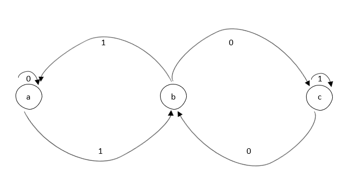

#### Results:

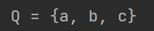

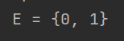

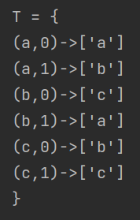

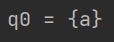

DFA:  
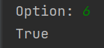

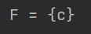

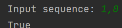

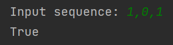

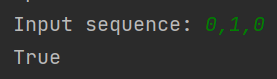

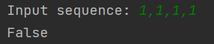

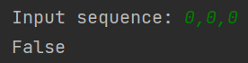

